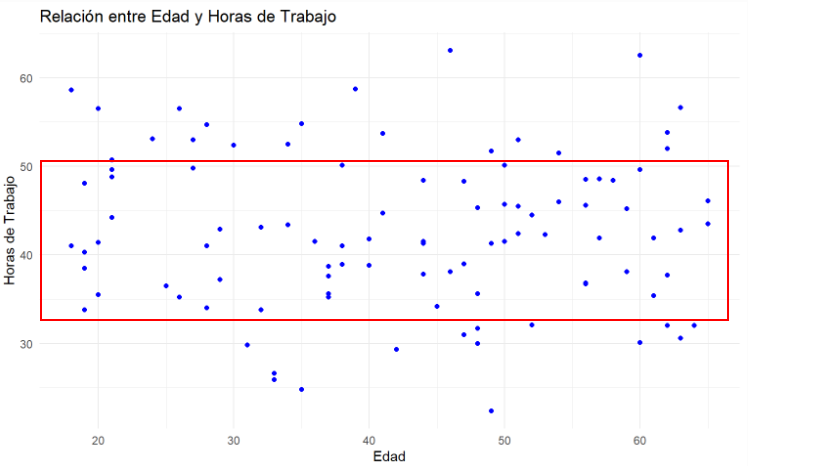

<style>

#main :not(.leaflet-control) > a {
  background-image: linear-gradient(180deg, #0099DB, #00A2E8);
  color: #000000;
}

#nav-top span.glyphicon {
    color: #191970;
}

#postamble {
 border-top:none;
}

#toc, #sidebar {
  background-color: #000000;
}

#toc a:hover {
  background-color: #6495ED;
  color: white;
}

#sidebar h2 {
  background-color: #191970;
}

#toc a {
  color: #FFFFF0;
}

h1, h2, h3 {
  color: #0000FF;
}

img.image-thumb {
    width: 100%;
    max-width: 10000px;
}

</style>

```{r setup, include = FALSE}
knitr::opts_chunk$set(echo = TRUE, include = TRUE)

# libreria para la interfaz:
# install.packages("rmdformats")

# libreria para la visualizacion de tablas:
# install.packages("DT")
library(DT)
```

# Introducción

En el ámbito de las ciencias sociales y la investigación de mercados, la recopilación y el análisis de datos juegan un papel fundamental en la toma de decisiones informadas. Este trabajo se enfoca en el análisis estadístico de un conjunto de datos con el objetivo de explorar diversas variables relacionadas con características demográficas y socioeconómicas, como el nivel educativo, el género, la edad, los ingresos mensuales, la cantidad de hermanos, y las horas de trabajo.

A lo largo de este análisis, se utilizarán métodos tanto descriptivos como inferenciales para proporcionar una visión clara sobre cómo se distribuyen y se relacionan las diferentes variables. Se abordarán desde las variables cualitativas (género y nivel educativo), hasta las cuantitativas (edad, ingreso mensual y horas de trabajo). Asimismo, se realizarán comparaciones y análisis gráficos para identificar posibles tendencias o patrones en los datos, lo que permitirá obtener conclusiones valiosas sobre los comportamientos y características de la muestra estudiada.

Este estudio emplea herramientas estadísticas básicas para presentar los resultados de forma clara y visual mediante gráficos, tablas y medidas fundamentales como la media, mediana, rango y desviación estándar.

# Marco Teórico

El análisis de datos es un proceso clave en la estadística y la investigación empírica. Se puede clasificar en diferentes tipos de variables que requieren técnicas específicas para su análisis:

**1. Variables cualitativas:** Son aquellas que no tienen un valor numérico, sino que describen categorías o cualidades. Pueden ser nominales (como el género) u ordinales (si existe un orden entre las categorías, como los niveles educativos). Para su análisis, se utilizan herramientas como las tablas de frecuencia y los gráficos de barras o de pastel.

**2. Variables cuantitativas:** Estas variables tienen valores numéricos y pueden ser discretas o continuas. Las variables discretas son aquellas que toman valores enteros o finitos, como el número de hermanos, mientras que las variables continuas pueden tomar un rango infinito de valores, como la estatura o los ingresos mensuales. El análisis de estas variables implica el uso de medidas de tendencia central (media, mediana) y dispersión (desviación estándar, varianza), además de gráficos como histogramas o diagramas de caja.

**3. Análisis univariado y bivariado:** En el análisis univariado, se examinan de manera individual las características de una sola variable. En el análisis bivariado, se exploran las relaciones entre dos variables para identificar correlaciones, tendencias o diferencias. Herramientas como los gráficos de dispersión y los diagramas de caja permiten visualizar estas relaciones de manera clara.

**4. Análisis de la distribución de variables:** Para las variables cuantitativas continuas, se busca comprender su distribución mediante el cálculo de medidas como el rango, que indica la diferencia entre el valor más alto y el más bajo, y el coeficiente de variación, que ayuda a comparar la variabilidad entre distintas distribuciones. Los percentiles y la varianza también son utilizados para describir la dispersión de los datos.

**5. Análisis de relaciones:** Una parte importante del análisis estadístico es identificar cómo las variables se relacionan entre sí. Se pueden realizar comparaciones de medias entre grupos para observar diferencias entre categorías (por ejemplo, comparar los ingresos según el nivel educativo). Estas comparaciones pueden realizarse mediante pruebas estadísticas y gráficos adecuados.

**6. Predicción y modelos estadísticos:** A través de la identificación de relaciones entre variables, es posible realizar predicciones. Por ejemplo, al analizar la relación entre las horas de trabajo y otras variables, como el nivel educativo o la edad, se puede intentar predecir el comportamiento de una variable en función de las demás.

# Configuraciones iniciales

## I. Cargar librerías necesarias

```{r libraries, message = 'false'}
# install.packages("ggplot2")
# install.packages("dplyr")
library(ggplot2)  
library(dplyr)
```
 
## II. Cargar la base de datos

Se carga la base de datos provista para el ejercicio en un data frame para poder ser usada

```{r ruta}
ruta <- "Base_Estadistica_Descriptiva.csv"
datos <- read.csv(ruta, header = TRUE, sep = ",")
```

## III. Configuración de la semilla y selección de datos

Se usa la semilla con los ultimos dos digitos de cada uno de los documentos de los integrantes. Despues de esto se toma una muestra de 100 datos

```{r}
set.seed(89025074)
muestra_datos <- datos[sample(nrow(datos), size = 100), 1:8]
```

## IV. Muestra obtenida

Esto se hace para verificar que se hayan seleccionado correctamente 100 datos de nuestra base de datos

```{r}
datatable(muestra_datos)
```

# 1. Análisis de Variables Cualitativas

## 1. Construir tablas de frecuencia y grafico de barras

```{r}
Nivel_Educativo <- muestra_datos$NivelEducativo; 

frecuencias_nivel_educativo <- table(Nivel_Educativo)

barplot(frecuencias_nivel_educativo,
        main = "Gráfico de Barras",
        xlab = "Categorías",
        ylab = "Frecuencia",
        col = "skyblue",
        border = "black")
```


## 2. Porcentaje de generos y grafico pastel

```{r}
frecuencia_genero <- table(muestra_datos$Genero)

pie(frecuencia_genero,
    labels = paste0(names(frecuencia_genero), " ", round(100 * frecuencia_genero / sum(frecuencia_genero), 10), "%"),
    main = "Gráfico de Pastel", 
    col = c("#2C517B", "#286EA1", "#6B96B9"),
    radius = 0.9)

```

# 2. Análisis de Variables Cuantitativas Discretas

## 3. Media, mediana y desviación estándar de la variable Edad.

```{r}
edad <- muestra_datos$Edad
media_edad <- mean(edad)
mediana_edad <- median(edad)
desviacion_edad <- sd(edad)
```

## 4. Personas con mas de tres hermanos

Se busca separar a los individuos que tienen mas de tres hermanos con el resto, posteriormente contar las frecuencias. 

```{r}
Grupo_Hermanos <- ifelse(muestra_datos$Hermanos > 3, "Más de 3 hermanos", "3 o menos hermanos")
tabla_hermanos <- table(Grupo_Hermanos)

barplot(tabla_hermanos,
        main = "Distribución por número de hermanos",
        xlab = "Grupo",
        ylab = "Cantidad de personas",
        col = c("dodgerblue4", "dodgerblue3"),
        border = "black")
```

## 5.Rango, varianza y coeficiente de variación de la variable IngresoMensual.

```{r}
rango <- range(muestra_datos$IngresoMensual)
rango_num <- diff(rango)
varianza <- var(muestra_datos$IngresoMensual)

desviacion_estandar <- sd(muestra_datos$IngresoMensual)
media <- mean(muestra_datos$IngresoMensual)
coef_variacion <- (desviacion_estandar / media) * 100

list(
  Rango = rango,                    
  AmplitudRango = rango_num, 
  Varianza = varianza,              
  DesviacionEstándar = desviacion_estandar, 
  CoeficienteVariación = coef_variacion 
)

```

# 3. Análisis de Variables Cuantitativas Continuas

## 6. Construye un histograma de la variable Estatura. ¿Qué puedes decir sobre su distribución?

```{r}
# Se usa la regla de Sturges para calcular la cantidad de clases a graficar
# posteriormente se calculara el ancho de la clase para tomarlo como argumento
# en geom_histogram
numero_clases <- 1 + (3.33 * log10(length(muestra_datos$Estatura)))

estatura_menor <- min(muestra_datos$Estatura)
estatura_mayor <- max(muestra_datos$Estatura)

ancho_clase <- (estatura_mayor - estatura_menor) / numero_clases

graf_hist <- ggplot(data = muestra_datos, aes(x = Estatura, fill = after_stat(count))) +
  geom_histogram(binwidth = ancho_clase, color = "black") +
  labs(title = "Histograma de estatura",
       x = "Estatura (m)",
       y = "Frecuencia") +
  scale_fill_gradient(low = "lightblue", high = "blue") +
  theme_minimal()

graf_hist
```

El histograma presenta una distribucion bimodal, lo que indica que las estaturas mas comunes se encuentran cerca de 1.60 y 1.80 metros, pero no entre estos valores. Tambien se puede observar una ligera asimetria a la derecha, lo que deja ver que no es comun poseer una estatura muy elevada.

## 7. Calcula la media y el percentil 90 de la variable HorasDeTrabajo. Interpreta los resultados.

```{r, results = 'asis'}
media_horas_trabajo <- mean(muestra_datos$HorasDeTrabajo)
cat("Media de horas de trabajo: ", media_horas_trabajo)

# Recordar que esto es una posicion
percentil_90 <- round((length(muestra_datos$HorasDeTrabajo) + 1) * 90 / 100)
cat("Percentil 90 de la variable HorasDeTrabajo: ", percentil_90)

cat("Dato en el percentil 90 (ordenando la informacion de menor a mayor): ", sort(muestra_datos$HorasDeTrabajo)[percentil_90])
```

Podemos entender que una persona que realizar mas de 53.8 horas de trabajo se encuentra en el 10% de los encuestados, lo que nos dice que realizar un poco mas de 10 horas respecto al promedio ya es algo inusual, es decir, dado que la media es 42.7 horas y el percentil 90 es 53.8 horas, una gran parte de las personas trabaja entre 42.7 y 53.8 horas. No obstante, tener una jornada mas larga corresponde a una minoria

# 4. Comparaciones entre Variables

## 8. Compara las alturas promedio (Estatura) por género (Genero). ¿Cuál es la diferencia más destacada?

```{r}
# Se filtran los datos segun genero
promedio_estatura_masculino <- mean(muestra_datos[muestra_datos$Genero == "Masculino", 6])
promedio_estatura_femenino <- mean(muestra_datos[muestra_datos$Genero == "Femenino", 6])

# Se crea un dataframe para poder realizar un grafico adecuadamente con ggplot
df_promedio_estatura <- data.frame(
  Genero = c("Masculino", "Femenino"),
  Promedio = c(promedio_estatura_masculino, promedio_estatura_femenino))

diag_barra <- ggplot(df_promedio_estatura, aes(x = Genero, y = Promedio)) +
  geom_bar(stat = "identity", fill = 4) +
  geom_text(aes(label = round(Promedio, 2)), vjust = -1, colour = "black") +
  coord_cartesian(ylim = c(1.7, 1.75)) +
  labs(title = "Promedio de Estatura por Género",
       x = "Género",
       y = "Promedio (m)")

diag_barra
```

La diferencia mas destacada que podemos encontrar es que, en promedio, el genero masculino tiene una estatura mayor al genero femenino

## 9. Analiza si los ingresos promedio (IngresoMensual) varían según el nivel educativo (NivelEducativo).

```{r}
# Se separan los datos teniendo en cuenta el nivel educativo, esto nos permite
# acceder a los datos segun el nivel deseado
nivel_educactivo <- split(muestra_datos, muestra_datos$NivelEducativo)

# Se crea un dataframe para poder realizar un grafico adecuadamente con ggplot
df_promedio_ingresos <- data.frame(Nivel = c("Primaria", "Secundaria", "Técnico", "Universitario"),
                                   Promedio = c(
                                     mean(nivel_educactivo$Primaria$IngresoMensual),
                                     mean(nivel_educactivo$Secundaria$IngresoMensual),
                                     mean(nivel_educactivo$Técnico$IngresoMensual),
                                     mean(nivel_educactivo$Universitario$IngresoMensual)))

diag_barra <- ggplot(df_promedio_ingresos, aes(x = Nivel, y = Promedio)) +
  geom_bar(stat = "identity", fill = 4) +
  geom_text(aes(label = round(Promedio, 2)), vjust = -1, colour = "black") +
  ylim(c(0, 2500)) +
  labs(title = "Promedio de Ingresos por Nivel Educativo",
       x = "Nivel Educativo",
       y = "Promedio ($)")

diag_barra
```

Los ingresos promedio si varian segun el nivel educativo, puesto que cada uno de ellos tienen un promedio diferente. Tambien se evidencia que los ingresos no tienen una relacion proporcional al nivel de educacion, lo que puede ser consecuancia de diversos factores externos

## 10. Compara las HorasDeTrabajo promedio entre personas con diferentes niveles educativos. ¿Qué observas?

```{r}
# Accedemos a la cantidad de horas de trabajo por nivel educativo gracias a la
# variable "nivel_educactivo" anteriormente creada. Se crea un dataframe para
# poder realizar un grafico adecuadamente con ggplot
df_promedio_horas_trabajo <- data.frame(Nivel = c("Primaria", "Secundaria", "Técnico", "Universitario"),
                                   Promedio = c(
                                     mean(nivel_educactivo$Primaria$HorasDeTrabajo),
                                     mean(nivel_educactivo$Secundaria$HorasDeTrabajo),
                                     mean(nivel_educactivo$Técnico$HorasDeTrabajo),
                                     mean(nivel_educactivo$Universitario$HorasDeTrabajo)))

diag_barra <- ggplot(df_promedio_horas_trabajo, aes(x = Nivel, y = Promedio)) +
  geom_bar(stat = "identity", fill = 4) +
  geom_text(aes(label = round(Promedio, 2)), vjust = -1, colour = "black") +
  ylim(c(0, 55)) +
  labs(title = "Promedio de Horas de Trabajo por Nivel Educativo",
       x = "Nivel Educativo",
       y = "Promedio (h)")

diag_barra
```

Se observa que las personas con un nivel tecnico trabajan, en promedio, una mayor cantidad de horas. En contraste con el analisis numero 9 (ingresos promedio segun nivel educativo) se muestra que, aunque las personas con nivel educativo de primaria tienen mayores ingresos, trabajan menos horas.

# 5. Análisis Gráfico

## 11. Diagrama de Caja y Bigotes representanto el ingreso Mensual por Nivel Educativo

```{r}
boxplot_ingreso <- ggplot(muestra_datos, aes(x = NivelEducativo, y = IngresoMensual)) +
  geom_boxplot(fill = "lightblue", color = "darkblue") +
  labs(title = "Diagrama de Caja y Bigotes: Ingreso Mensual por Nivel Educativo",
       x = "Nivel Educativo", y = "Ingreso Mensual") +
  theme_minimal()
boxplot_ingreso
```

Este gráfico muestra cómo varía el ingreso mensual según el nivel educativo (Primaria, Secundaria, Técnico y Universitario). Cada caja representa la mediana, el rango intercuartil (25% - 75%) y los valores extremos (bigotes).

- En general, los ingresos tienden a ser más altos para niveles educativos como Técnico y Universitario en comparación con Primaria y Secundaria.
- Se observan valores atípicos (, especialmente en el nivel Primaria, lo cual indica que algunas personas con este nivel educativo tienen ingresos significativamente mayores que el promedio.
- Esto puede ser un reflejo de factores como experiencia laboral u otros aspectos que influyen en el ingreso.

## 12. Gráfico de dispersión con la relación entre Edad y Horas de Trabajo

```{r}
scatter_plot <- ggplot(muestra_datos, aes(x = Edad, y = HorasDeTrabajo)) +
  geom_point(color = "blue") +
  labs(title = "Relación entre Edad y Horas de Trabajo",
       x = "Edad", y = "Horas de Trabajo") +
  theme_minimal()
scatter_plot
```

## Observaciones principales del gráfico de dispersión



Como podemos ver en la imagen, la mayoría de puntos del gráfico de dispersión se encuentran entre 50 y 30    , lo que indica que la mayoría de trabajadores trabajan alrededor de 40 horas independientemente de su edad.

# 6. Análisis Conjunto

## 13. Tabla de doble entrada representando la distribución conjunta de Género y Nivel Educativo

```{r}
tabla_conjunta <- table(muestra_datos$Genero, muestra_datos$NivelEducativo)
tabla_conjunta
```

La tabla muestra la distribución de personas según su género y nivel educativo. Cada celda representa la cantidad de personas de un género específico que alcanzaron un nivel educativo determinado.

- El nivel Secundaria parece ser el más común en el género femenino (12 personas).
- Los géneros "Masculino" y "Otro" presentan menores frecuencias en niveles como Universitario o Primaria.
- Esto puede ser útil para observar tendencias de acceso educativo según género y tomar decisiones basadas en datos.

## 14. Proporción de personas con más de 2 hermanos e ingreso mensual > $3000

```{r}
filtro <- filter(muestra_datos, IngresoMensual > 3000)
proporcion <- nrow(filtro) / nrow(muestra_datos %>% filter(Hermanos > 2))
proporcion
```

En esta parte, se analiza qué proporción de personas con más de dos hermanos tienen un ingreso mensual superior a $3000.

- La proporción se calcula como el número de personas que cumplen ambas condiciones dividido entre el total de personas con más de dos hermanos.
- Este análisis es importante para explorar la relación entre el tamaño de la familia y los ingresos, mostrando si factores como la carga familiar influyen en los ingresos.

La proporción calculada indica que aproximadamente el 16.95% de las personas en la muestra tienen más de 2 hermanos y dentro de este grupo, tienen un ingreso mensual mayor a $3000.

# 7. Reflexión

## 15. Análisis de resultados
El Nivel Educativo parece tener una relación significativa con el ingreso mensual, ya que las personas con niveles educativos más altos suelen acceder a mejores empleos.

## 16. Variables que eligiria para predecir las horas de trabajo

Si quisiera predecir las Horas de Trabajo, elegiría Edad, Nivel Educativo e Ingreso Mensual.
Esto se debe a que estas variables pueden estar relacionadas con la cantidad de horas que una persona trabaja, según su etapa de vida, formación y tipo de empleo.

# Bibliografía

- Estadística Descriptiva y Probabilidad (Teoría y problemas) (3.a ed.). (2006). Universidad de Cádiz.
- Bluman, A. G. (2014). Estadística: Un Enfoque Aplicado (9ª ed.). McGraw-Hill.
- Devore, J., Probabilidad y Estadística para ingenieros y científicos, Cengage learning editores – México, 2006
- Siqueira, D. (2023, 29 marzo). Histograma: qué es, ejemplos, gráficos y tipos. Alura. <https://www.aluracursos.com/blog/histograma-que-es-ejemplos-graficos-y-tipos>
