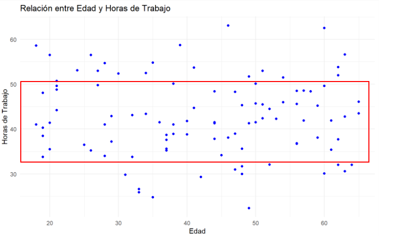

<style>

/* Cambiar el fondo de la barra lateral */

#postamble{
 border-top:none;
}

#toc, #sidebar {
  background-color: #000000; /* Color de fondo */
}

#toc a:hover {
  background-color: #6495ED; /* Color del texto */
  color: white;
}

#sidebar h2 {
  background-color: #191970;    /* Color de la barra lateral */
}

#toc a {
  color: #FFFFF0; /* Color del texto */
}


h1, h2, h3 {
  color: #0000FF; /* Color de los encabezados */
}

img.image-thumb  {
    width: 100%; 
    max-width: 10000px;
}
</style>


```{r setup, include=FALSE}
knitr::opts_chunk$set(echo = TRUE)
```

# Cargar librerías necesarias
```{r libraries, message='false'}
library(ggplot2)  
library(dplyr)
```
# Cargar la base de datos
Se carga la base de datos provista para el ejercicio y se pone en una tabla para poder ser usada
```{r ruta}
ruta <- "Base_Estadistica_Descriptiva.csv"
muestra_datos <- read.csv(ruta, header = TRUE, sep = ",")
```

# Configuración de la semilla y selección de datos
Se usa la semilla con los ultimos dos digitos de cada uno de los documentos de los integrantes

Despues de esto se toma una muestra de 100 datos
```{r}
set.seed(89025074)
muestra_datos <- muestra_datos[sample(nrow(muestra_datos), size = 100), 1:8]
```


# Número de filas en la muestra
Esto se hace para verificar que se hayan seleccionado correctamente 100 datos de nuestra base de datos
```{r}
nrow(muestra_datos)
```


# Diagrama de Caja y Bigotes representanto el ingreso Mensual por Nivel Educativo
```{r}
boxplot_ingreso <- ggplot(muestra_datos, aes(x = NivelEducativo, y = IngresoMensual)) +
  geom_boxplot(fill = "lightblue", color = "darkblue") +
  labs(title = "Diagrama de Caja y Bigotes: Ingreso Mensual por Nivel Educativo",
       x = "Nivel Educativo", y = "Ingreso Mensual") +
  theme_minimal()
boxplot_ingreso
```
Este gráfico muestra cómo varía el ingreso mensual según el nivel educativo (Primaria, Secundaria, Técnico y Universitario). Cada caja representa la mediana, el rango intercuartil (25% - 75%) y los valores extremos (bigotes).


- En general, los ingresos tienden a ser más altos para niveles educativos como Técnico y Universitario en comparación con Primaria y Secundaria.
- Se observan valores atípicos (, especialmente en el nivel Primaria, lo cual indica que algunas personas con este nivel educativo tienen ingresos significativamente mayores que el promedio.
- Esto puede ser un reflejo de factores como experiencia laboral u otros aspectos que influyen en el ingreso.

# Gráfico de dispersión con la relación entre Edad y Horas de Trabajo
```{r}
scatter_plot <- ggplot(muestra_datos, aes(x = Edad, y = HorasDeTrabajo)) +
  geom_point(color = "blue") +
  labs(title = "Relación entre Edad y Horas de Trabajo",
       x = "Edad", y = "Horas de Trabajo") +
  theme_minimal()
scatter_plot
```


# Observaciones principales del gráfico de dispersión



Como podemos ver en la imagen, la mayoría de puntos del gráfico de dispersión se encuentran entre 50 y 30    , lo que indica que la mayoría de trabajadores trabajan alrededor de 40 horas independientemente de su edad.

# Tabla de doble entrada representando la distribución conjunta de Género y Nivel Educativo
```{r}
tabla_conjunta <- table(muestra_datos$Genero, muestra_datos$NivelEducativo)
tabla_conjunta
```
La tabla muestra la distribución de personas según su género y nivel educativo. Cada celda representa la cantidad de personas de un género específico que alcanzaron un nivel educativo determinado.

- El nivel Secundaria parece ser el más común en el género femenino (12 personas).
- Los géneros "Masculino" y "Otro" presentan menores frecuencias en niveles como Universitario o Primaria.
- Esto puede ser útil para observar tendencias de acceso educativo según género y tomar decisiones basadas en datos.

# Proporción de personas con más de 2 hermanos e ingreso mensual > $3000
```{r}
filtro <- filter(muestra_datos, IngresoMensual > 3000)
proporcion <- nrow(filtro) / nrow(muestra_datos %>% filter(Hermanos > 2))
proporcion
```

En esta parte, se analiza qué proporción de personas con más de dos hermanos tienen un ingreso mensual superior a $3000.

- La proporción se calcula como el número de personas que cumplen ambas condiciones dividido entre el total de personas con más de dos hermanos.
- Este análisis es importante para explorar la relación entre el tamaño de la familia y los ingresos, mostrando si factores como la carga familiar influyen en los ingresos.

La proporción calculada indica que aproximadamente el 16.95% de las personas en la muestra tienen más de 2 hermanos y dentro de este grupo, tienen un ingreso mensual mayor a $3000.


# Análisis de resultados
El Nivel Educativo parece tener una relación significativa con el ingreso mensual, ya que las personas con niveles educativos más altos suelen acceder a mejores empleos.


Si quisiera predecir las Horas de Trabajo, elegiría Edad, Nivel Educativo e Ingreso Mensual.
Esto se debe a que estas variables pueden estar relacionadas con la cantidad de horas que una persona trabaja, según su etapa de vida, formación y tipo de empleo.


